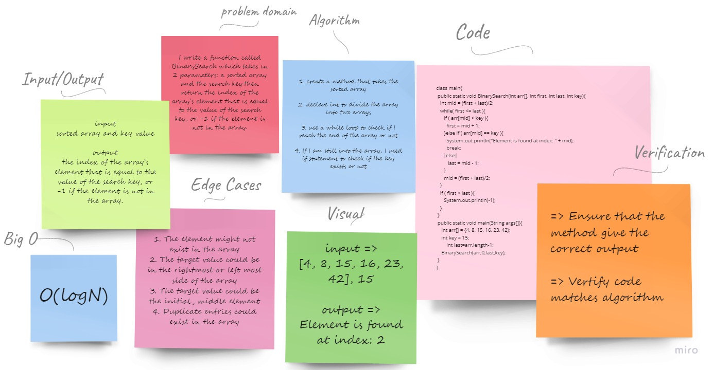

# Array Binary Search 

* In this challenge I Wrote a function called BinarySearch which takes in 2 parameters: a sorted array and the search key.then return the index of the array’s element that is equal to the value of the search key, or -1 if the element is not in the array.

## **Whiteboard Process 📝**

## **Approach & Efficiency**

* In this challenge, I used Binary search to find the key because the binary search has a lot of advantage like:

     * Since it follows the technique to eliminate half of the array elements, it is more efficient as compared to linear search for large data.

     * Better time complexity and thus takes less compilation time.

     * An improvement over linear search as it breaks the array down in half rather than sequentially traversing through the array elements

* Binary Search Time Complexity

    * Best Time Complexity: O(1)
    * Average Time Complexity: O(log N)
    * Worst Time Complexity: O(log N)