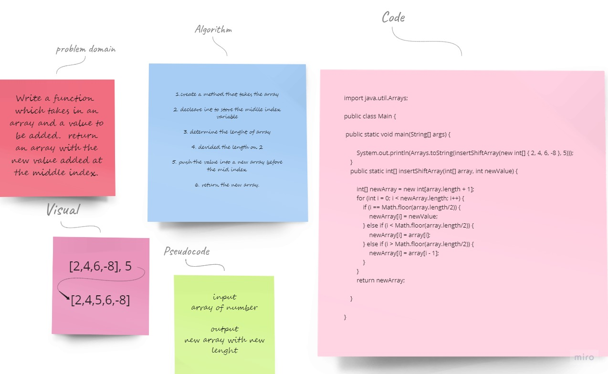

# Array Insert Shift

## **Whiteboard : 📝**



### My code

```
import java.util.Arrays;

public class Main {

    public static void main(String[] args) {

        System.out.println(Arrays.toString(insertShiftArray(new int[] { 2, 4, 6, -8 }, 5)));
    }
    public static int[] insertShiftArray(int[] array, int newValue) {

        int[] newArray = new int[array.length + 1];
        for (int i = 0; i < newArray.length; i++) {
            if (i == Math.floor(array.length/2)) {
                newArray[i] = newValue;
            } else if (i < Math.floor(array.length/2)) {
                newArray[i] = array[i];
            } else if (i > Math.floor(array.length/2)) {
                newArray[i] = array[i - 1];
            }
        }
        return newArray;

    }
    
}

```
