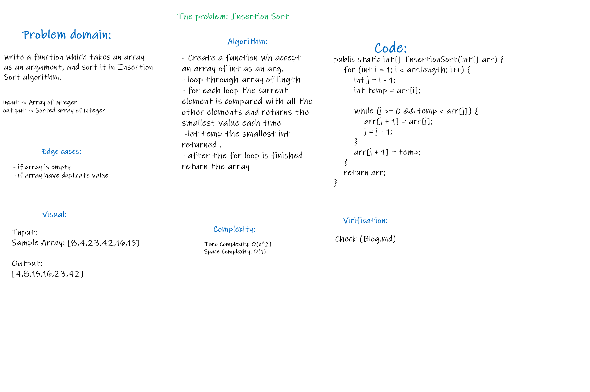
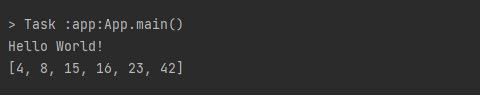

# Insertion Sort
Insertion sort works similar to the sorting of playing cards in hands. It is assumed that the first card is already sorted in the card game, and then we select an unsorted card. If the selected unsorted card is greater than the first card, it will be placed on the right side; otherwise, it will be placed on the left side. Similarly, all unsorted cards are taken and put in their exact place.

## Whiteboard Process


## Approach & Efficiency
* Efficency:
    * Time: O(n^2)
    * Space: O(1)


## Solution
Check [Blog](BLOG.md)

* **Code:**

```java
    public static int[] InsertionSort(int[] arr) {
        for (int i = 1; i < arr.length; i++) {
            int j = i - 1;
            int temp = arr[i];

            while (j >= 0 && temp < arr[j]) {
                arr[j + 1] = arr[j];
                j = j - 1;
            }
            arr[j + 1] = temp;
        }
        return arr;
    }
```

* **Output:**




 