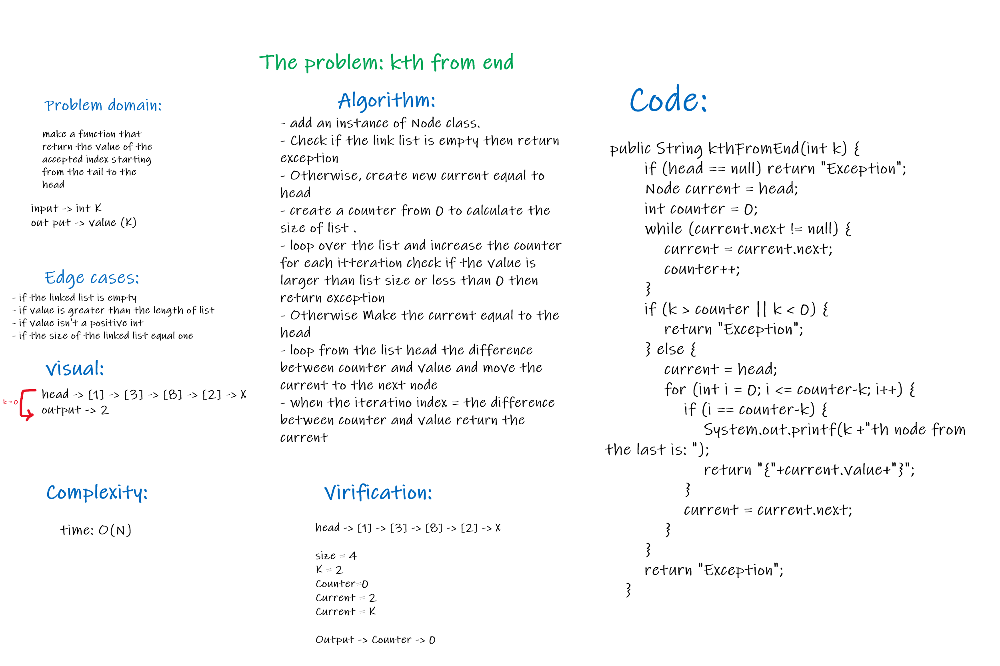

# Singly Linked List

*A singly linked list is a type of linked list that is unidirectional, that is, it can be traversed in only one direction from head to the last node (tail).*

*Each element in a linked list is called a node. A single node contains data and a pointer to the next node*

## Challenge

* Create a LinkedList by:
  * Create a Node class
  * Create a LinkedList class.

* The methods I used:
  * Insert values to the LinkedList.
  * Check If the value exists in the LinkedList or not.
  * Print out the values of nodes following this format "{ a } -> { b } -> { c } -> NULL".

## Approach & Efficiency

    * insert method complexity : Insert in the front (O(1)), Random insert (O(N))
    * includes method complexity : time (O(n))
    * toString method complexity : time (O(n))

## API

* Insert()

```
 This method checks if the head is null will add the value and set it to the head, If not then it will iterate through the nodes until the one that points to null, then will set this pointer to indicate to the new node that holds the new value.
 ```

* Includes()

```
This method checks whether the input value equals any of the nodes' values or not until reaching to the last node
```

* toString()

```
This method print out the values of nodes following this format "{ a } -> { b } -> { c } -> NULL".
 ```

# Append Challenge

## Challenge Summary

 ```
adds a new node to the end of the list
```

## Whiteboard Process


## Approach & Efficiency

```
while loop to iterate over the linked list nodes the complexity: time :O(n)
```

## Solution

```java
public class App {

    public static void main(String[] args) {

        LinkedList myList = new LinkedList();
        Node current = myList.head;
        myList.append(0);
        myList.append(4);
        myList.append(5);
        System.out.println(myList.toString());
    }
}


```

Output:


# Insert After Challenge

## Challenge Summary

 ```
method to add a new node after the node that has a value equal to the accepted value
```

## Whiteboard Process


## Approach & Efficiency

```
while loop to iterate over the linked list nodes the complexity: time :O(n)
```

## Solution

```java
public class App {

    public static void main(String[] args) {

        LinkedList myList = new LinkedList();
        Node current = myList.head;
        myList.append(0);
        myList.append(4);
        myList.append(5);
        myList.insertAfter(5, 6);
        myList.insertAfter(6, 8);
        System.out.println(myList.toString());
    }
}


```

Output:


# Insert Before Challenge

## Challenge Summary

 ```
method to add a new node before the node that has a value equal to the accepted value
```

## Whiteboard Process


## Approach & Efficiency

```
while loop to iterate over the linked list nodes the complexity:time :O(N)
```

## Solution

```java
public class App {

    public static void main(String[] args) {

        LinkedList myList = new LinkedList();
        Node current = myList.head;
        myList.append(0);
        myList.append(4);
        myList.append(5);
        myList.insertAfter(5, 6);
        myList.insertAfter(6, 8);
        myList.insertBefore(8, 7);
        myList.insertBefore(4, 3);
        System.out.println(myList.toString());
    }
}


```

Output:


# kth from end

## Challenge Summary

 ```
method accept a value and return the node value that is k places from the tail of the linked list.
```

## Whiteboard Process



## Approach & Efficiency

```
while loop to iterate over the linked list nodes the complexity:time :O(N)
```

## Solution

```java
public class App {

    public static void main(String[] args) {

        LinkedList myList = new LinkedList();
        Node current = myList.head;
        myList.append(0);
        myList.append(4);
        myList.append(5);
        myList.insertAfter(5, 6);
        myList.insertAfter(6, 8);
        myList.insertBefore(8, 7);
        myList.insertBefore(4, 3);
        //////////
        System.out.println(myList.kthFromEnd(1));
        System.out.println(myList.kthFromEnd(6));
        System.out.println(myList.kthFromEnd(10));
        System.out.println(myList.toString());
        //////////
    }
}


```

Output:


# Zip two linked lists

## Challenge Summary

 ```
method responsible about zipping two linked list and return the head for the zipped linked list
```

## Whiteboard Process


## Approach & Efficiency

```
while loop to iterate over the linked list nodes the complexity:time :O(N)
```

## Solution

```java
 public Node zipLists(LinkedList list1, LinkedList list2) {

        if (list1.head == null && list2.head == null) return null;
        if (list1.head == null) return list2.head;
        if (list2.head == null) return list1.head;

        LinkedList newZippedList = new LinkedList();
        newZippedList.head = list1.head;

        Node current = list1.head;
        list1.head = list1.head.next;

        while (current != null && (list2.head != null || list1.head != null)) {
        if (list2.head != null) {
        current.next = list2.head;
        list2.head = list2.head.next;
        current = current.next;
        }
        if (list1.head != null) {
        current.next = list1.head;
        list1.head = list1.head.next;
        current = current.next;
        }
        }
        return newZippedList.head;
        }

```

Output:


