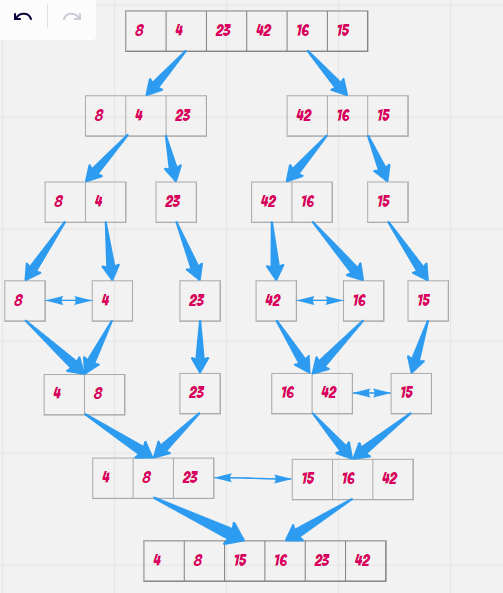

# Merge Sort
Merge sort is one of the most efficient sorting algorithms. It works on the principle of Divide and Conquer. Merge sort repeatedly breaks down a list into several sublists until each sublist consists of a single element and merging those sublists in a manner that results into a sorted list


## Pseudocode
```java
ALGORITHM Mergesort(arr)
        DECLARE n <-- arr.length

        if n > 1
        DECLARE mid <-- n/2
        DECLARE left <-- arr[0...mid]
        DECLARE right <-- arr[mid...n]
        // sort the left side
        Mergesort(left)
        // sort the right side
        Mergesort(right)
        // merge the sorted left and right sides together
        Merge(left, right, arr)

        ALGORITHM Merge(left, right, arr)
        DECLARE i <-- 0
        DECLARE j <-- 0
        DECLARE k <-- 0

        while i < left.length && j < right.length
        if left[i] <= right[j]
        arr[k] <-- left[i]
        i <-- i + 1
        else
        arr[k] <-- right[j]
        j <-- j + 1

        k <-- k + 1

        if i = left.length
        set remaining entries in arr to remaining values in right
        else
        set remaining entries in arr to remaining values in left

```


### Trace
Sample Array: [8,4,23,42,16,15]




**Steps:**

* divide array into two parts left and right.

* divide each part into tow part.

* keep dividing until each part has one element

* comparing if left element is less or equal right element then assign min element to current.

* if left is empty,then set remaining entries in arr to remaining values in right

* if right is empty,then set remaining entries in arr to remaining values in left

* merge sort array [4,8,15,16,23,42]

* **Efficency**
    * Time: θ(nLogn)
    * Space:  O(n)(1)
