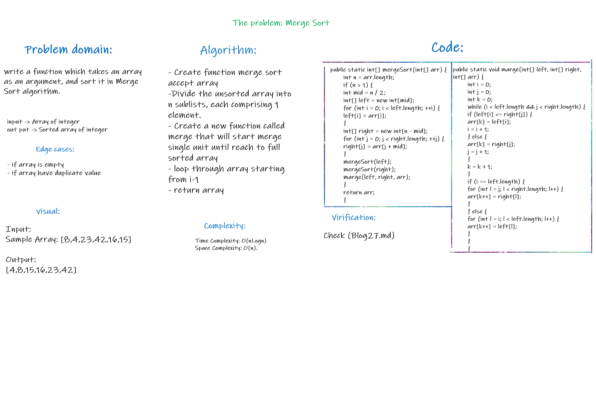
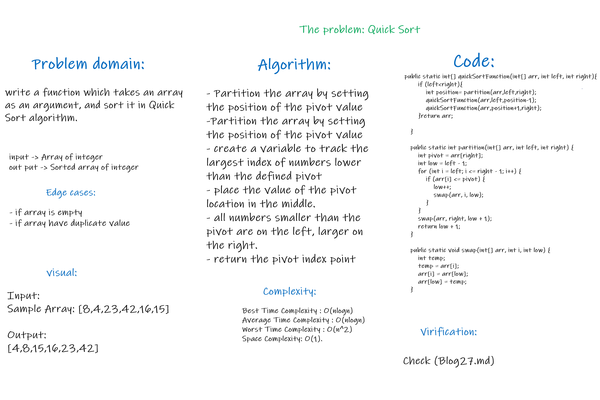

# Sort 

## **Merge Sort:**
*Merge Sort is a Divide and Conquer algorithm. It divides the input array into two halves, calls itself for the two halves, and then merges the two sorted halvesز*

## Whiteboard Process


## Approach & Efficiency
* Efficency:
    * Time: θ(nLogn)
    * Space:  O(n)


## Solution
Check [Blog](Blog27.md)

* **Code:**

```java
  public static int[] mergeSort(int[] arr) {
        int n = arr.length;
        if (n > 1) {
        int mid = n / 2;
        int[] left = new int[mid];
        for (int i = 0; i < left.length; ++i) {
        left[i] = arr[i];
        }
        int[] right = new int[n - mid];
        for (int j = 0; j < right.length; ++j) {
        right[j] = arr[j + mid];
        }
        mergeSort(left);
        mergeSort(right);
        marge(left, right, arr);
        }
        return arr;
        }

public static void marge(int[] left, int[] right, int[] arr) {
        int i = 0;
        int j = 0;
        int k = 0;
        while (i < left.length && j < right.length) {
        if (left[i] <= right[j]) {
        arr[k] = left[i];
        i = i + 1;
        } else {
        arr[k] = right[j];
        j = j + 1;
        }
        k = k + 1;
        }
        if (i == left.length) {
        for (int l = j; l < right.length; l++) {
        arr[k++] = right[l];
        }
        } else {
        for (int l = i; l < left.length; l++) {
        arr[k++] = left[l];
        }
        }
        }

```

* **Output:**


## **Quick Sort:**
*QuickSort is a Divide and Conquer algorithm. It picks an element as pivot and partitions the given array around the picked pivot.*

## Whiteboard Process


## Approach & Efficiency
* Efficency:
  * Best Time Complexity : O(nlogn)
  * Average Time Complexity : O(nlogn)
  * Worst Time Complexity : O(n^2)
  * Space Complexity: O(1).


## Solution
Check [Blog](Blog28.md)


* **Code:**

```java
   public static int[] quickSortFunction(int[] arr, int left, int right){
        if (left<right){
            int position= partition(arr,left,right);
            quickSortFunction(arr,left,position-1);
            quickSortFunction(arr,position+1,right);
        }return arr;

    }

    public static int partition(int[] arr, int left, int right) {
        int pivot = arr[right];
        int low = left - 1;
        for (int i = left; i <= right - 1; i++) {
            if (arr[i] <= pivot) {
                low++;
                swap(arr, i, low);
            }
        }
        swap(arr, right, low + 1);
        return low + 1;
    }

    public static void swap(int[] arr, int i, int low) {
        int temp;
        temp = arr[i];
        arr[i] = arr[low];
        arr[low] = temp;
    }

```

* **Output:**

