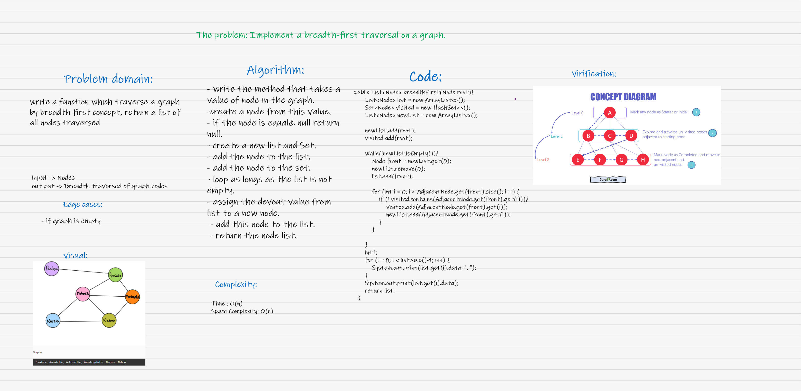
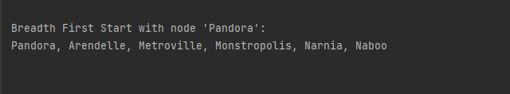
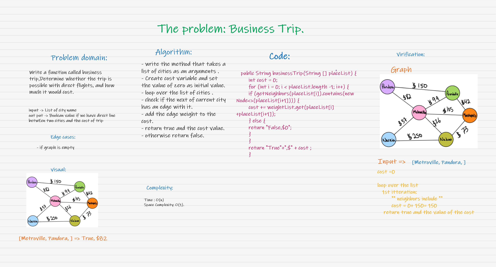
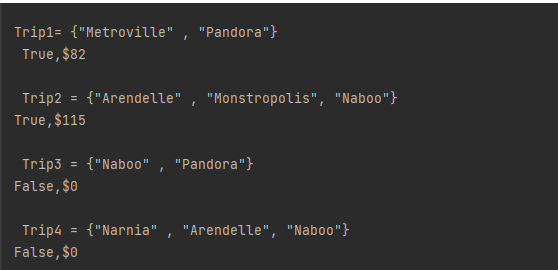
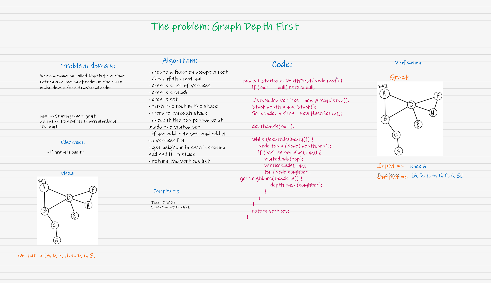
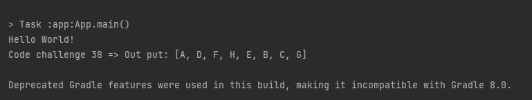

# Graphs
A graph is a non-linear data structure that can be looked at as a collection of vertices (or nodes) potentially connected by line segments named edges.

## Challenge
* *Implement your own Graph. The graph should be represented as an adjacency list, and should include the following methods*
    
    * **add node**

        * Arguments: value
        * Returns: The added node
        * Add a node to the graph

    * **add edge**

        * Arguments: 2 nodes to be connected by the edge, weight (optional)
        * Returns: nothing
        * Adds a new edge between two nodes in the graph
        * If specified, assign a weight to the edge
        * Both nodes should already be in the Graph

    * **get nodes**
        * Arguments: none
        * Returns all of the nodes in the graph as a collection (set, list, or similar)

    * **get neighbors**
        * Arguments: node
        * Returns a collection of edges connected to the given node
        * Include the weight of the connection in the returned collection

    * **size**
        * Arguments: none
        * Returns the total number of nodes in the graph


## Approach & Efficiency
* **add node** : time = O(1) because we didnt use loops, space = O(n) because we declared a new ArrayList.

* **add edge** : time = O(1) because we didnt use loops, space = O(1) because we didnt declare any arrays.

* **get nodes** : time = O(n) because we use loop , space = O(n) because we declared a HashSet.

* **get neighbors** : O(1) for both time and space complexity because there is no loops or arrays.

* **size** : O(1) for both time and space complexity.


## API
* **add node** : this method is to add a new node to the graph.

* **add edge** : this method is to add a new edge between two Nodes in the graph.

* **get nodes** : this method returns a HashSet which contains all the Nodes in the graph.

* **get neighbors** : this method return a list of all the Nodes that are connected to the Node we pass.

* **size** : this method returns the size of the graph HashSet.

## **breadth-first traversal on a graph**

# Challenge Summary
*write a function which traverse a graph by breadth first concept , and return a list of all the nodes traversed.*


## Whiteboard Process


## Approach & Efficiency
time : O(n^2) `nested loop`

scape : O(n) `create new list and Set`

## Solution

* **code**

```java
  public List<Node> breadthFirst(Node root){
        List<Node> list = new ArrayList<>();
        Set<Node> visited = new HashSet<>();
        List<Node> newList = new ArrayList<>();

        newList.add(root);
        visited.add(root);

        while(!newList.isEmpty()){
            Node front = newList.get(0);
            newList.remove(0);
            list.add(front);

            for (int i = 0; i < AdjacentNode.get(front).size(); i++) {
                if (! visited.contains(AdjacentNode.get(front).get(i))){
                    visited.add(AdjacentNode.get(front).get(i));
                    newList.add(AdjacentNode.get(front).get(i));
                }
            }

        }
        int i;
        for (i = 0; i < list.size()-1; i++) {
            System.out.print(list.get(i).data+", ");
        }
        System.out.print(list.get(i).data);
        return list;
    }
```


* **Solution:**




## **Business Trip**

# Challenge Summary
* *Write a function called business trip,Determine whether the trip is possible with direct flights, and how much it would cost.*
     * Arguments: graph, array of city names
     * Return: cost or null


## Whiteboard Process


## Approach & Efficiency
time : O(n) `loop`

scape : O(1)

## Solution

* **code**

```java
     public String businessTrip(String [] placeList) {
        int cost = 0;
        for (int i = 0; i < placeList.length -1; i++) {
        if (getNeighbors(placeList[i]).contains(new Node<>(placeList[i+1]))) {
        cost += weightList.get(placeList[i] +placeList[i+1]);
        } else {
        return "False,$0";
        }
        }
        return "True"+",$" + cost ;
        }
```


* **Solution:**




## **Graph Depth First**

# Challenge Summary
* *Write the following method for the Graph class:*
    * Name: Depth first
    * Arguments: Node (Starting point of search)
    * Return: A collection of nodes in their pre-order depth-first traversal order
    * Program output: Display the collection


## Whiteboard Process


## Approach & Efficiency
time : O(n^2) `neasted loop`

scape : O(n)  

## Solution

* **code**

```java
      public List<Node> DepthFirst(Node root) {
        if (root == null) return null;

        List<Node> vertices = new ArrayList<>();
        Stack depth = new Stack();
        Set<Node> visited = new HashSet<>();

        depth.push(root);

        while (!depth.isEmpty()) {
        Node top = (Node) depth.pop();
        if (!visited.contains(top)) {
        visited.add(top);
        vertices.add(top);
        for (Node neighbor : getNeighbors(top.data)) {
        depth.push(neighbor);}
             }
          }
        return vertices;
        }
```


* **Output:**

