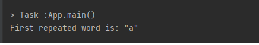

# Hashtables
*Hashtables : technique that is used to uniquely identify a specific object from a group of similar objects.*

*Hashtables are a data structure that utilize key value pairs. This means every `Node` or `Bucket` has both a key, and a value*


## Challenge
*implement HashTable class with 4 methods (add , hash , contains , get).*

## Approach & Efficiency
* Time : if the bucket has no collisions, Hash tables are O(1) average. this is the perfect hashing.

  but however it suffers from O(n) in the collisions cases.

* Space: complexity of O(n).

## API
* **add()**
    * To add a new key-value pair to the hash table.

* **get()**
    * To check and return the value of the given key.

* **contains()**
    * To check if the key exists in the hash table and returns a boolian acordingly.

* **hash()**
    * Takes a key and convert it to an integer index.


# **First repeated word**
# Challenge Summary
*Write a function called repeated word that finds the first word to occur more than once in a string*

## Whiteboard Process


## Approach & Efficiency
   * Time :O(n).
   * Space: complexity of O(n).

## Solution

* **Code:**

```java
    public static String RepeatedWord(String string) {
        HashTable<String, String> Words = new HashTable<>();
        String[] Arr = string.split(" ");
        for (String word : Arr) {
            word =word.replaceAll("[^a-zA-Z]", "").toLowerCase();
            if (Words.containsHash(word)) {
                return word;
            } else {
                Words.add(word,word);
            }
        }
        return "Ooops 🤯 There's no repeated 🎉";
    }
```

* **Output:**




# **Common values in 2 binary trees**
# Challenge Summary
* *Write a function called tree_intersection that takes two binary trees as parameters.*
* *Using your Hashmap implementation as a part of your algorithm, return a set of values found in both trees.*

## Whiteboard Process


## Approach & Efficiency
* Time :O(n).
* Space: complexity of O(n).

## Solution

* **Code:**

```java
   public class TreeInsertion<K, T> {
  HashTable<K, T> hashTable = new HashTable<>();
  public void preOrder(Node root) {
    if (root != null) {
      hashTable.add((K) root.value, (T) root.value);
    }
    if (root.left != null) {
      preOrder(root.left);
    }
    if (root.right != null) {
      preOrder(root.right);
    }
  }
  public List treeInsertion(Node Tree1, Node Tree2) {
    if (Tree1.root == null || Tree2.root == null) {
      return null;
    }else{
      List Temp = new ArrayList();
      preOrder(Tree1.root);
      traverse(Tree2.root, Temp);
      return Temp;
    }
  }
  public void traverse(Node root, List Temp) {
    if (root != null) {
      if (hashTable.containsHash((K) root.value)) {
        Temp.add(root.value);
      }
      if (root.left != null) {
        traverse(root.left, Temp);
      }
      if (root.right != null) {
        traverse(root.right, Temp);
      }
    }
  }
}
```

* **Output:**


# **Implement a simplified LEFT JOIN for 2 Hashmaps**
# Challenge Summary
* function called left join
* Arguments: two hash maps
  * The first parameter is a hashmap that has word strings as keys, and a synonym of the key as values.
  * The second parameter is a hashmap that has word strings as keys, and antonyms of the key as values.
* Return: The returned data structure

## Whiteboard Process


## Approach & Efficiency
* Time :O(n).
* Space: complexity of O(n).

## Solution

* **Code:**

```java
 public class LeftJoin {

  public static List<String> leftJoin(HashMap hashMap1, HashMap hashMap2){
    List<String> Keylist = new ArrayList<>();
    for(Object i : hashMap1.keySet()){
      if(hashMap1.containsKey(i)){
        Keylist.add("{"+i +  ": " + hashMap1.get(i)+ ", " + hashMap2.get(i)+"}");
      } else{
        Keylist.add(i + ": " + hashMap1.get(i) + ", " + null);
      }
    }
    return Keylist;
  }
}
```

* **Output:**


