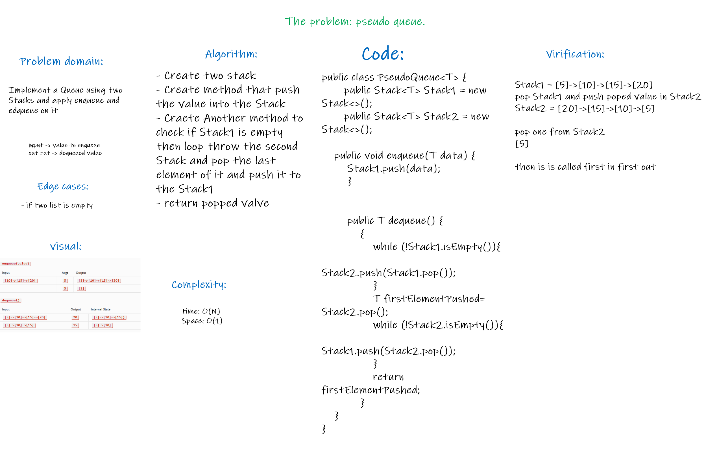
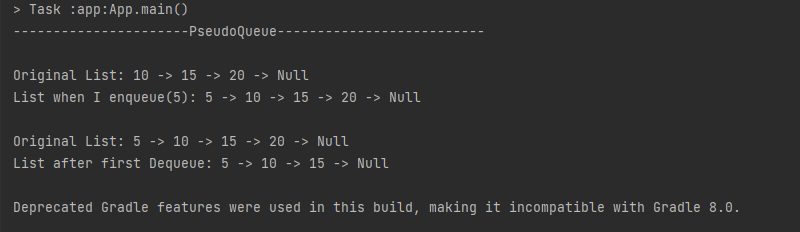

# Stacks and Queues
* **Stacks**
  * *A stack is a data structure that consists of Nodes. Each Node references the next Node in the stack, but does not reference its previous.*
  * *In the stacks only two operations are allowed: push the item into the stack, and pop the item out of the stack.*

* **Queues**
  * *An excellent example of a queue is a line of students. New additions to a line made to the back of the queue, while removal (or serving) happens in the front*
  * *In the queue only two operations are allowed enqueue and dequeue. Enqueue means to insert an item into the back of the queue, dequeue means removing the front item.* 


## Challenge
Create a Stack class that has a top property. It creates an empty Stack when instantiated and Create a Queue class that has a front property. It creates an empty Queue when instantiated

* The Stack class should contain the following methods:
  * `pop`
  * `push`
  * `peek`
  * `isEmpty`

* The queue class should contain the following methods:
  * `enqueue`
  * `dequeue`
  * `peek`
  * `isEmpty`


## Approach & Efficiency

* **Stacks**

**For all method Time: O(1) and Space: O(1)**

* **Queues**

**For all method Time: O(1) and Space: O(1)**

## API

* **Stacks**

    * **pop:** Removes the node from the top of the stack.
    * **push:** Adds a new node with that value to the top of the stack.
    * **peek:** Returns the top of the stack.
    * **isEmpty:** Returns Boolean indicating whether the stack is empty.

* **Queues**

  * **enqueue:** Adds a new node with that value to the back of the queue.
  * **dequeue:** Removes the node from the front of the queue.
  * **peek:** Returns the front of the queue.
  * **isEmpty:** Returns Boolean indicating whether the queue is empty.


# Pseudo Queue

## Challenge Summary
Implement a Queue using two Stacks and apply enqueue and edqueue on it

## Whiteboard Process



## Approach & Efficiency

  * `enqueue` : Time: O(1) and Space: O(1)
  * `dequeue` : Time: O(1) and Space: O(1)


## Solution

* Code:
```java
public class PseudoQueue<T> {
       public Stack<T> Stack1 = new Stack<>();
       public Stack<T> Stack2 = new Stack<>();

    public void enqueue(T data) {
        Stack1.push(data);
        }


        public T dequeue() {
            {
                while (!Stack1.isEmpty()){
                    Stack2.push(Stack1.pop());
                }
                T firstElementPushed= Stack2.pop();
                while (!Stack2.isEmpty()){
                    Stack1.push(Stack2.pop());
                }
                return firstElementPushed;
            }
    }
}
```

* Output:
 
