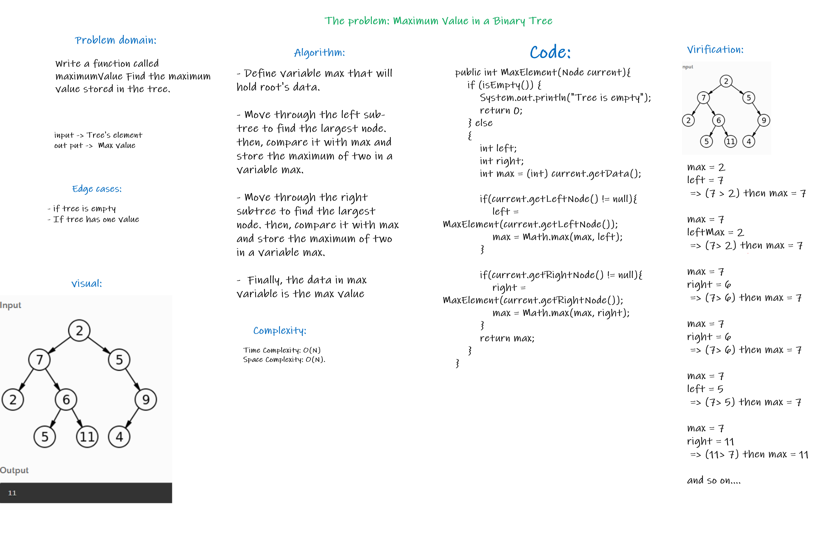
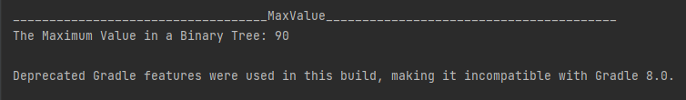
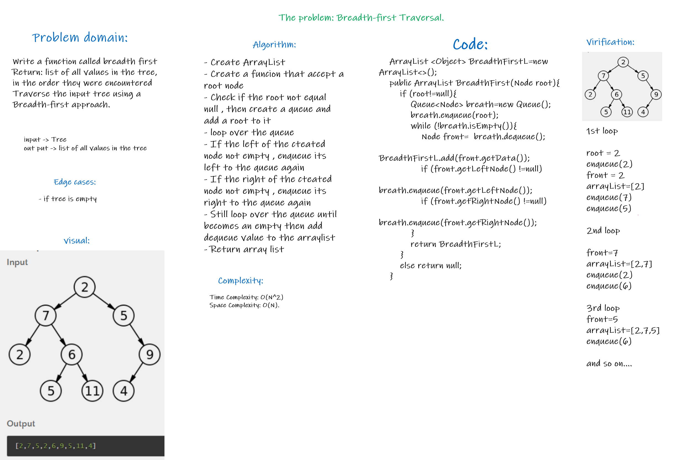
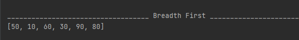

# Trees

*A tree is a non linier data structure that is like a list but that uses nodes starting at a root then point to more than one “next” node.*
*General trees consist of the nodes having any number of child nodes. But in case of binary trees every node can have at the most two child nodes and There is a unique node called root in trees.*

## Challenge

* `Node class` Node class has properties for the value stored in the node, the left child node, and the right child node.
* `Binary Tree class` BinaryTree class Define a method for each of the depth first traversals.
* `Binary Search Tree class` Binary Search Tree that is a sub class of the Binary tree with two more methods (Add and contains)

## Approach & Efficiency

* `Binary Tree class`
  * `pre order` O(n) for the time and the space
  * `in order` O(n) for the time and the space
  * `post order` O(n) for the time and the space


* `Binary Search Tree class`
  * `Add` O(n) for the time and the space
  * `Contains` O(n) for the time and the space


## API

* `Binary Tree class`
  * `pre order` traverse over the tree (Root,Left,Right)
  * `in order` traverse over the tree (Left,Root,Right)
  * `post order` traverse over the tree (Left,Right,Root)


* `Binary Search Tree class`
  * `Add` to add a node hold the accepted value to the proper position inside the tree
  * `Contains` that checks if the tree has the node with accepted value


# maximum value in the tree

## Challenge Summary
Write a function called maximumValue Find the maximum value stored in the tree.

## Whiteboard Process



## Approach & Efficiency

* Time Complexity: O(N)
* Space Complexity: O(N).

## Solution

* Code:

```java

public int MaxValue(Node current){
    if (isEmpty()) {
        return 0;
    } else
    {
        int left;
        int right;
        int max = (int) current.getData();

        if(current.getLeftNode() != null){
            left = MaxValue(current.getLeftNode());
            max = Math.max(max, left);
        }

        if(current.getRightNode() != null){
            right = MaxValue(current.getRightNode());
            max = Math.max(max, right);
        }
        return max;
    }
```

* Output:




# Breadth-first Traversal.

## Challenge Summary
Write a function called breadth first Return: list of all values in the tree, in the order they were encountered Traverse the input tree using a Breadth-first approach.

## Whiteboard Process



## Approach & Efficiency

* Time Complexity: O(N^2)
* Space Complexity: O(N).

## Solution

* Code:

```java
    ArrayList <Object> BreadthFirstL=new ArrayList<>();
    public ArrayList BreadthFirst(Node root){
        if (root!=null){
            Queue<Node> breath=new Queue();
            breath.enqueue(root);
            while (!breath.isEmpty()){
                Node front=  breath.dequeue();
                BreadthFirstL.add(front.getData());
                if (front.getLeftNode() !=null)
                    breath.enqueue(front.getLeftNode());
                if (front.getRightNode() !=null)
                    breath.enqueue(front.getRightNode());
            }
            return BreadthFirstL;
        }
        else return null;
    }
```

* Output:

